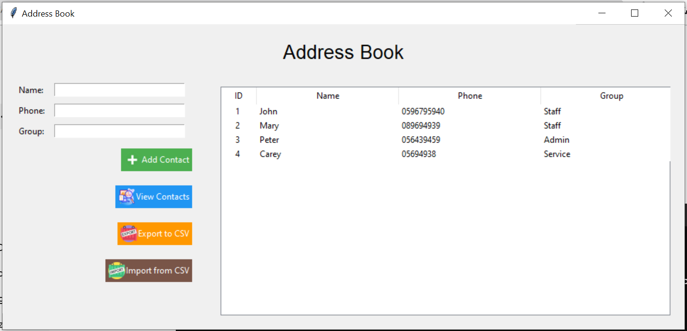
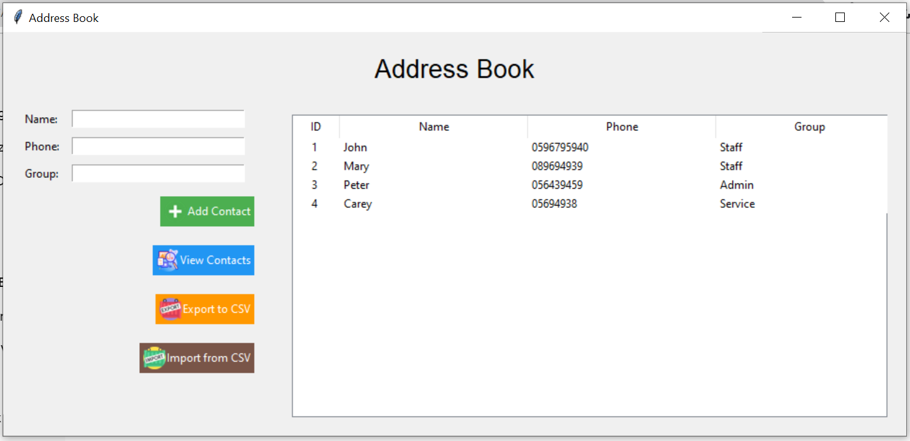

# SQLite Address Book

Manage your contacts effortlessly with this user-friendly Python GUI application. Powered by SQLite, it offers a seamless experience for adding, viewing, editing, and deleting contacts. Import and export contacts conveniently in CSV format. Stay organized with group categorization and an intuitive interface.

!

## Features

- **Add Contacts**: Easily add new contacts with their name, phone number, and group.
- **View Contacts**: Browse through your contacts with a tree view display.
- **Edit Contacts**: Update contact information such as phone number or group.
- **Delete Contacts**: Remove unwanted contacts with a click.
- **Export to CSV**: Save your contacts to a CSV file for backup or sharing.
- **Import from CSV**: Quickly import contacts from a CSV file.

## Installation

1. Clone the repository:
   ```bash
   git clone https://github.com/yourusername/address-book.git

1. Navigate to the project directory:
```bash
cd address-book
```

2. Install the required dependencies:

```bash
pip install -r requirements.txt
```


3. Run the application:

```bash
python address_book_gui.py
```

### **Usage**

* **Add Contact**: Fill in the name, phone number, and optionally the group for the new contact. Click "Add Contact" to save.
* **View Contacts**: The contacts are displayed in a tree view format. Scroll through or search for specific contacts.
* **Edit Contact**: Select a contact from the list, update the fields, and click "Add Contact" to save changes.
* **Delete Contact**: Select a contact and click "Delete Contact" to remove it from the address book.
* **Export to CSV**: Click "Export to CSV" to save all contacts to a CSV file.
* **Import from CSV**: Click "Import from CSV" to add contacts from a CSV file.


### **Screenshots**




### Contributing

Contributions are welcome! If you have any feature requests, bug reports, or suggestions, please open an issue or a pull request.


### **License**

This project is licensed under the MIT License - see the LICENSE file for details.
